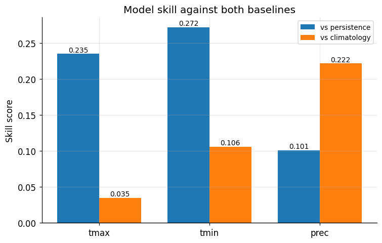

# Spain Weather Forecasting

**A deep learning model that forecasts the next 7 days of temperature and rainfall for any weather station in Spain, using AEMET's open public data.**

**🌦️ [Live dashboard](https://spain-weather-forecasting.streamlit.app)** — pick a station on the map and see its 7-day forecast.

---

## What is this? (in plain words)

Spain's weather agency (AEMET) publishes daily records from hundreds of weather stations. This project uses that **open data** to train a **deep learning model** that predicts, for any station, the **maximum and minimum temperature and the rainfall of the next 7 days** from the last 30 days of observations.

A single model works for the **whole country**: it learns the "fingerprint" of each station's local climate, so the same network forecasts for Madrid, the coast or the mountains.

**Why it matters:** short-range temperature and rain forecasts feed decisions in agriculture, energy, water management and climate-risk analysis — exactly the kind of problem climate-tech works on, here solved end to end with public data.

## Headline result

The model is measured honestly against two reference methods anyone uses as a sanity check: **persistence** ("tomorrow will be like today") and **climatology** ("the historical average for this date"). It **beats both** on the variables that matter, and — most importantly — it **adds real skill for rainfall**, where simpler models fail.

- ✅ Beats "tomorrow = today" on **all three variables** (temperature and rain).
- ✅ Beats the historical average on **minimum temperature and rainfall**.
- 🌧️ For **rainfall**, the gradient-boosting baseline (LightGBM) has essentially **no skill**, while the deep learning model keeps positive skill at every horizon — the clearest win of the project.

## How it works (in brief)

- **Input → output:** 30 days of weather in → 7 days of forecast out (t+1 … t+7), all at once.
- **One global model** with a learned **station embedding** instead of one model per station.
- **Architecture:** a **seq2seq encoder-decoder with attention** (an LSTM-based sequence model).
- **Honest evaluation:** rolling-origin out-of-sample testing with **skill scores vs persistence and climatology** (a single test window can be misleading).

📓 Full technical walkthrough in [`notebooks/4-DL_seq2seq_model.ipynb`](notebooks/4-DL_seq2seq_model.ipynb).

**Status:** Complete — data pipeline, EDA, ML baseline and DL model.

---

## Notebooks

| Notebook | Content |
|---|---|
| `1-EDA` | Exploratory analysis and station selection |
| `2-Naive_baselines` | Persistence and climatology reference baselines |
| `3-ML_baseline` | XGBoost / LightGBM baselines (t+1, t+3, t+7) |
| `4-DL_seq2seq_model` | Deep learning model, results and ML-vs-DL comparison |

---

## Overview

This project builds and evaluates ML/DL models to **forecast daily maximum temperature, minimum temperature and precipitation at 1 to 7-day horizons** across Spain's SYNOP meteorological network.

The forecasting task is framed as a multivariate regression problem over meteorological time series. Classical ML approaches (LightGBM and XGBoost) are evaluated at t+1, t+3 and t+7 as reference baselines. The deep learning phase develops a seq2seq (encoder-decoder + attention) architecture with station embedding that predicts all seven daily horizons simultaneously across the SYNOP station network.

## EDA Highlights

### Station network coverage

### Long-term warming trend — decadal evolution of daily maximum temperature

### Time series decomposition — daily maximum temperature · Madrid-Retiro

---

## Project Phases

**Phase 1 — EDA & Station Selection**  
Exploratory analysis of the full dataset. Selection of stations with continuous records since 1991 and less than 10% missing data, following WMO quality standards. Spatial and temporal characterisation of temperature and precipitation across Spain's SYNOP network.

**Phase 2 — ML Baseline**  
Training and evaluation of XGBoost and LightGBM regressors for 1, 3 and 7-day forecast horizons. Random Forest was evaluated and discarded due to systematically higher MAE and training times 8–10× longer than gradient boosting models. Evaluation metrics: RMSE, MAE and R². LightGBM and XGBoost produced comparable results across all prototype stations and horizons; LightGBM was selected as the final ML baseline based on consistent superiority at t+1 and greater stability across stations. A single model is retained as baseline to provide a clean reference point for DL comparison.

**Phase 3 — DL Sequence Models** *(complete)*  
A seq2seq (encoder-decoder with attention) architecture with station embedding predicts all seven daily horizons (t+1 to t+7) simultaneously for maximum temperature, minimum temperature and precipitation.

The ML and DL approaches differ not just in architecture but in how they use data. The gradient-boosting models are **vertical**: one model per station, trained on 30 years of that station's history alone — no information is shared across the network. The seq2seq model is **horizontal**: a single global model trained across ~137 stations simultaneously, with a learned **station embedding** that captures each location's climate fingerprint (altitude, latitude, regional regime). This cross-station learning is what allows the DL model to work with 15 years of history instead of 30 — the network compensates with breadth. It also explains why the station selection criteria differ between the ML baseline (4 prototype stations, long records) and the DL phase (all stations with sufficient recent feature coverage).

Evaluated with rolling-origin out-of-sample testing and skill scores against persistence and climatology. Key findings: the model beats persistence on all three variables and climatology on minimum temperature and precipitation; maximum temperature sits at the climatology ceiling (the limit of a station-history-only model versus numerical weather prediction); and it adds genuine precipitation skill where the gradient-boosting baseline has none. 15 years of history was validated empirically as the optimum. The training set is determined by data availability, recent gap tolerance and valid observations in recent months, and varies with model configuration.

---

## Data

| | |
|---|---|
| **Agency** | AEMET — Agencia Estatal de Meteorología |
| **Network** | SYNOP (~270 stations across Spain) |
| **API** | AEMET OpenData API |
| **Target variables** | Daily maximum temperature · Daily minimum temperature · Daily precipitation |
| **Feature variables** | Lagged tmax, tmin, prec · Atmospheric pressure · Relative humidity · Solar radiation · Wind speed · Altitude · Coordinates |
| **Coverage** | 1920–present (full database); 1991–present (stations meeting WMO quality criteria, used in EDA and ML baseline) |
| **Volume** | 3.5M+ daily records (full database); 1.25M filtered records (stations meeting WMO quality criteria, 1991–present) |

---

## Data Pipeline

A robust extraction pipeline was built to extract and validate historical records from the AEMET API prior to modelling:

- Incremental extraction per station with adaptive retry logic and rate limit management
- Gap auditing: detection and quantification of missing intervals
- Historical backfill: automated recovery of missing records with multi-attempt verification
- PostgreSQL database storing 3.5M+ validated daily records

Pipeline code available in `data_pipeline/`.

---

## Station Selection Criteria

The analysis is restricted to stations belonging to Spain's SYNOP network — those with an assigned SYNOP identifier that report to the WMO global observation network. AEMET operates a larger network of additional stations outside this scheme; these were not considered.

Within the SYNOP network, stations are included in the EDA and ML baseline analysis if they meet all of the following quality criteria:

- Continuous records since **1991**, covering the current AEMET climatological reference period (1991–2020)
- Minimum record span of **30 years** (WMO standard)
- **Less than 10% missing data** over the full record span (row coverage), following the completeness threshold used by the WMO for centennial station recognition

98 stations meet these criteria across 51 of Spain's 52 provinces.

The training set for the deep learning phase is determined separately, based on feature availability, recent gap tolerance and valid observations in recent months. It does not necessarily coincide with the 98-station EDA subset.

---

## Tech Stack

| Component | Technology |
|---|---|
| Data extraction & processing | Python · Pandas · NumPy |
| Database | PostgreSQL |
| ML models | Scikit-learn · XGBoost · LightGBM |
| DL models | TensorFlow · Keras |
| Visualisation | Matplotlib · Seaborn |
| Version control | Git · GitHub |

---

## Author

Helena Alcolea Ruiz · Physicist (BSc + MSc in Complex Systems) · Data Scientist · [LinkedIn](https://www.linkedin.com/in/helena-alcolea/) · [GitHub](https://github.com/Helena-Alcolea)

*Independent portfolio project using AEMET open data (source attributed); not affiliated with or endorsed by AEMET.*

